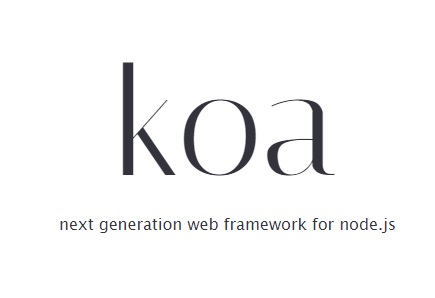

# KOA 백엔드 프레임워크를 통한 백엔드 개발 :rocket:

Express - 미들웨어, 라우팅, 템플릿 파일 호스팅 등 다양한 기능이 내장. 
KOA - 미들웨어 기능만 갖추고 나머지는 라이브러리를 적용하여 사용. (그때 그때 필요한 기능 붙여서)


&nbsp;
## **파일 크기**   
Express(무겁다) < KOA(가볍다) 

## **특징**
 - async/await 문법을 정식으로 지원. (비동기 작업이 편해짐)
 - 미들웨어의 배열로 구성되어 있음. 
## 참고

Nodejs로 서버를 개발 시, Express or KOA는 개인 취향.  


## 계획 

Nodejs를 통한 서버 개발을 할 예정. (블로그를 만들기위해 진행할 예정이다.)


## 잡다한 팁들, 실수한 것. 

- Prettier에서 관리하는 코드 스타일을 ESLint에서 관리하지 않도록 eslint-config-prettier을 설치하면 문제가 해결된다. 그리고 설치 후 .eslintrc.json에서 extends에서 배열형태로 이를 추가시켜 준다. 

```json

    {
        "env": {
            "node": true,
            "commonjs": true,
            "es6": true
        },
        "extends": ["eslint:recommended", "prettier"],
        "globals": {
            "Atomics": "readonly",
            "SharedArrayBuffer": "readonly"
        },
        "parserOptions": {
            "ecmaVersion": 2018
        },
        "rules": {
        }
    }
```

- 미들 웨어 함수의 구조 

```javascript

    // ctx(context의 줄임말): 웹 요청, 응답에 관한 정보를 가지고 있음
    // next 처리중인 미들웨어의 다음 미들웨어를 호출하는 함수
    // 사용안하면 그 다음 미들웨어를 처리하지 않는다. 
    test(ctx, next)=> {

    }


```

- nodemon  
nodemon dependency는 코드를 변경할 때마다 서버를 자동으로 재시작해준다.

```bash

    yarn add -D nodemon

```

```json
    // in package.json
    // src directory를 주시하고 있다가 안에 파일이 변화가 일어나면 이를 감지해서 src/index.js 파일을 재시작 함.
    
    "scripts": {
        "start:dev" : "nodemon  watch src/ src/index.js
    }


```
